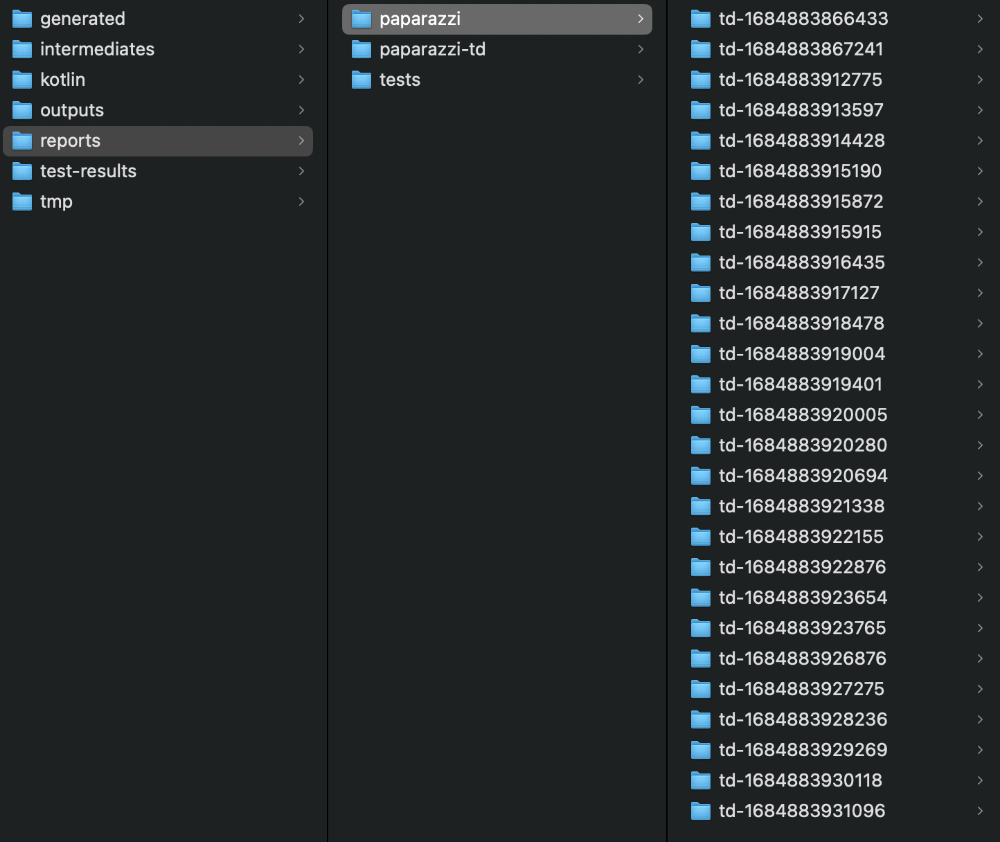
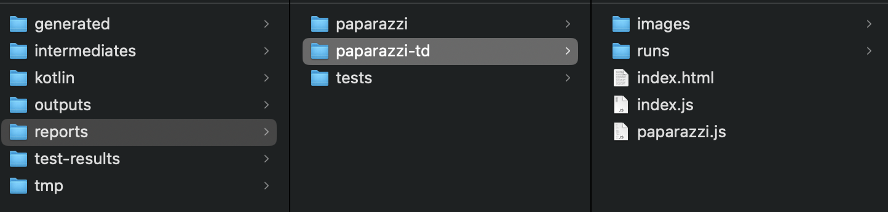
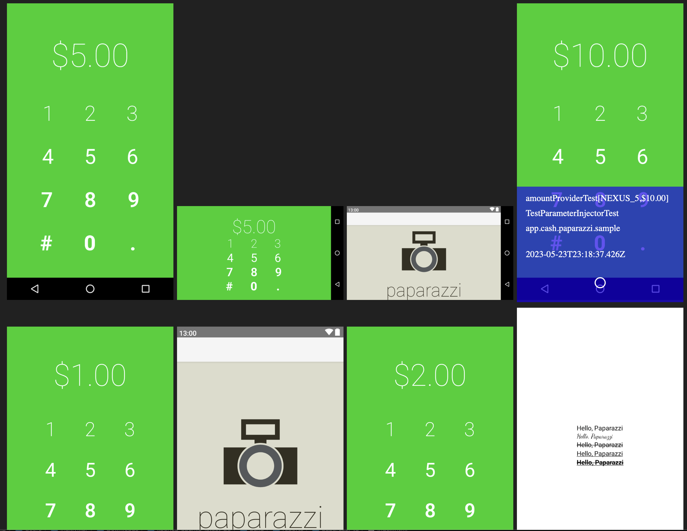

# Test Distribution Extension for Paparazzi

Compatibility library to use Paparazzi with Gradle Enterprise Test Distribution.

### Paparazzi
https://github.com/cashapp/paparazzi
Paparazzi is an Android library that allows render your application screens without a physical
device or emulator.

### Gradle Enterprise Test Distribution
https://docs.gradle.com/enterprise/test-distribution/
Historical test execution data provided by Gradle Enterprise is used to create balanced partitions
of similar expected execution times in order to optimize distribution across remote agents.
The tests and their supporting files are transferred to each agent and executed, with their
logging and results streamed back to the build in real time.
If there are no remote agents available, tests can still be executed locally on the build machine.

## The problem

Test Distributions supports merging outputs of the different remote agents at the end of the test
execution. However, Paparazzi is creating an unique output with the results of the tests, when
finishing
the test task, Test Distributions throws the exception:

```
Test sessions created conflicting fragments in output directory
'example/internal/build/reports/paparazzi' for 'index.html', 'index.js', 'paparazzi.js'
```

## The solution

This library provides an output writer with an individual output per test execution.

```
td-1684883866433
  - images
  - runs
  - videos
  ...
td-1684883867241
  - images
  - runs
  - videos
  ...
td-1684883912775
  - images
  - runs
  - videos
  ...
td-1684883913597
  - images
  - runs
  - videos
  ...
```

Later, in the client side we will be able to merge the test outputs(see next section)

## Usage

### Include the TD Paparazzi extension

In your build.gradle(.kts) define:

```
testImplementation("io.github.cdsap:td-paparazzi-ext:0.1")
```

### Update your Paparazzi tests to use the new Html writer `TDPaparazziHandlerProvider`

```
    @get:Rule
    val paparazzi = Paparazzi(
        snapshotHandler = TDPaparazziHandlerProvider().determineHandler(0.1)
    )

```

### Configure the inputs/outputs required for Test Distribution

```
tasks.withType(Test).configureEach {
    useJUnitPlatform()
    // Define the resources.txt as input
    inputs.file("build/intermediates/paparazzi/${it.name.replace("UnitTest", "").replace("test", "").toLowerCase()}/resources.txt")
    // Include the new output that will merge the outputs of the different remote agents
    outputs.dir("build/reports/paparazzi-td/")
    // Include the failures outputs to be merged
    outputs.dir("out/failures/")
    distribution {
      ...
}
```

### Define the merging task

```
@CacheableTask
abstract class MergeOutputTask : DefaultTask() {
    @get:InputDirectory
    @get:PathSensitive(PathSensitivity.NONE)
    abstract val artifactFiles: DirectoryProperty

    @get:Internal
    val runList = mutableListOf<String>()

    @get:OutputDirectory
    abstract val outputFile: DirectoryProperty

    @TaskAction
    fun writeResourcesFile() {
        val inputDirectory = artifactFiles.get()
        if (inputDirectory.asFile.walkTopDown().count() > 1) {
            val foldersToCopy = listOf("runs", "images", "videos")
            val outputDirectory = outputFile.get()
            createOutputDirectories(outputDirectory)
            createStaticFiles(inputDirectory, outputDirectory)
            inputDirectory.asFile.walkTopDown()
                .filter { it.isDirectory && it.name.startsWith("td-") }
                .forEach {
                    it.walkTopDown().forEach {
                        if (it.isDirectory && foldersToCopy.contains(it.name)) {
                            copyResources(it, outputDirectory)
                            if (it.name == "runs") {
                                extractRuns(it)
                            }
                        }
                    }

                }
            writeRunsJs(outputDirectory)

        }
    }

    private fun copyResources(it: File, outputDirectory: Directory) {
        it.copyRecursively(
            File("$outputDirectory/${it.name}"), overwrite = true
        )
    }

    private fun extractRuns(it: File) {
        it.walkTopDown().filter { it -> it.name != "runs" }
            .forEach { runList.add(it.name.replace(".js", "")) }
    }

    private fun writeRunsJs(outputDirectory: Directory) {
        var runFormatted = ""
        runList.forEach {
            runFormatted += "\"$it\",\n"
        }

        File("$outputDirectory/index.js").writeText(
            """
          window.all_runs = [
            ${runFormatted.dropLast(1)}
          ];
        """.trimIndent()
        )
    }

    private fun createStaticFiles(
        inputDirectory: Directory, outputDirectory: Directory
    ) {
        inputDirectory.asFileTree.filter { it.name == "index.html" }.first()
            .copyTo(File("$outputDirectory/index.html"))
        inputDirectory.asFileTree.filter { it.name == "paparazzi.js" }.first()
            .copyTo(File("$outputDirectory/paparazzi.js"))
    }

    private fun createOutputDirectories(outputDirectory: Directory) {
        if (File("$outputDirectory/images").isDirectory && File("$outputDirectory/images").exists()) {
            File("$outputDirectory/images").deleteRecursively()
        }
        if (File("$outputDirectory/videos").isDirectory && File("$outputDirectory/videos").exists()) {
            File("$outputDirectory/videos").deleteRecursively()
        }
        if (File("$outputDirectory/runs").isDirectory && File("$outputDirectory/runs").exists()) {
            File("$outputDirectory/runs").deleteRecursively()
        }
        if (File("$outputDirectory/index.html").exists()) {
            File("$outputDirectory/index.html").delete()
        }
        if (File("$outputDirectory/index.js").exists()) {
            File("$outputDirectory/index.js").delete()
        }
        if (File("$outputDirectory/paparazzi.js").exists()) {
            File("$outputDirectory/paparazzi.js").delete()
        }
        val images = File("$outputDirectory/images")
        val runs = File("$outputDirectory/runs")
        val videos = File("$outputDirectory/videos")
        images.mkdir()
        runs.mkdir()
        videos.mkdir()
    }
}
```
https://github.com/cdsap/PaparazziTestDistributionExtension/blob/main/android-library/build.gradle.kts#L72

### Register the Merging task

```

androidComponents {
    onVariants(selector().all()) { variant ->
        val mergeOutputTask = project.tasks.register(
            "mergePaparazzi${variant.name.capitalized()}Outputs", MergeOutputTask::class.java
        ) {
            dependsOn(tasks.named("test${variant.name.capitalized()}UnitTest"))
            artifactFiles.set(layout.projectDirectory.dir("build/reports/paparazzi"))
            outputFile.set(layout.projectDirectory.dir("build/reports/paparazzi-td"))
        }

        project.tasks.withType<Test>().configureEach {
            if (name == "test${variant.name.capitalized()}UnitTest") {
                finalizedBy(mergeOutputTask)
            }
        }
    }
}

```
https://github.com/cdsap/PaparazziTestDistributionExtension/blob/main/android-library/build.gradle.kts#L53
## Sample

This repository includes the project `sample` with the complete implementation of the extension:
https://github.com/cdsap/PaparazziTestDistributionExtension/blob/main/android-library/build.gradle.kts

## Output

### Individual reports



### Merged reports



### Example output after merging the individual reports



## Notes

The configuration is tested for Paparazzi executions of one build variant.
