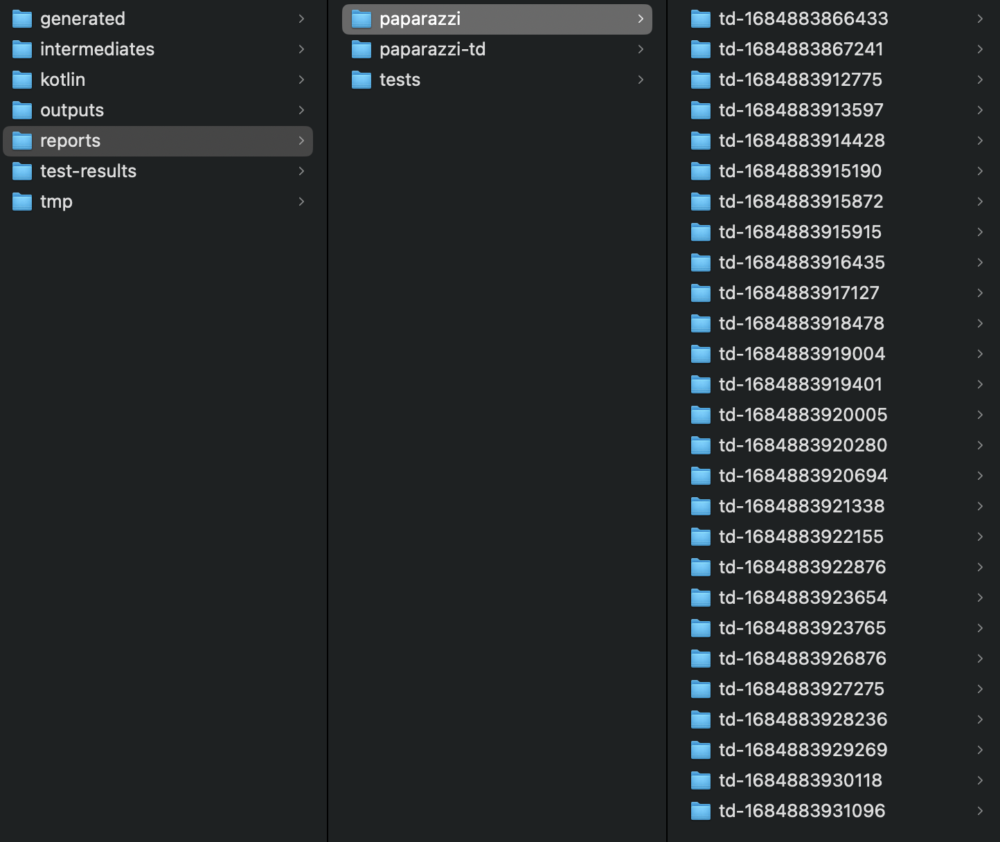
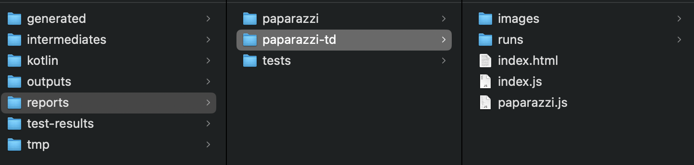
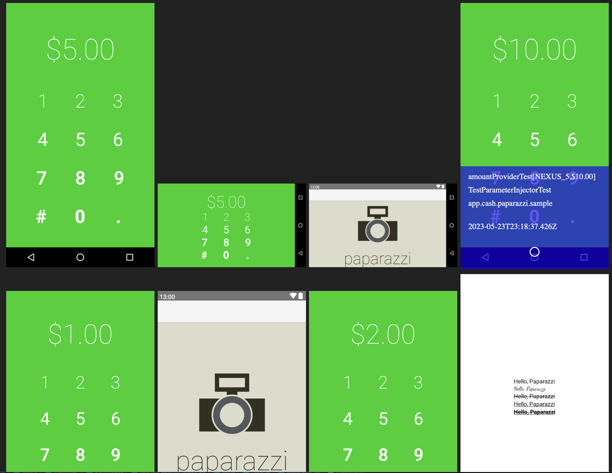

# Test Distribution Extension for Paparazzi

Compatibility library and Gradle plugin to use [Paparazzi](https://github.com/cashapp/paparazzi) with [Develocity Test Distribution](https://docs.gradle.com/develocity/current/administration/admin-manual/#test_distribution).

## The problem

Test Distribution distributes test execution across remote agents. When tests finish,
it merges outputs from each agent. Paparazzi generates a single HTML report per test run,
causing conflicts when multiple agents write to the same output directory:

```
Test sessions created conflicting fragments in output directory
'example/internal/build/reports/paparazzi' for 'index.html', 'index.js', 'paparazzi.js'
```

## The solution

This extension generates individual report directories per test execution (`td-<timestamp>/`),
avoiding fragment conflicts. A Gradle plugin handles merging the individual reports into
a single consolidated report after all tests complete.

```
build/reports/paparazzi/
  td-1684883866433/
    images/
    runs/
    videos/
  td-1684883867241/
    images/
    runs/
    videos/
```

## Compatibility

The library is decoupled from the Paparazzi constructor, so it works across Paparazzi versions:

| Paparazzi version | AGP | Gradle | Status |
|---|---|---|---|
| 2.0.0-alpha02 | 8.13.1 | 8.13 | Tested |
| 2.0.0-alpha03 | 8.13.1 | 8.13 | Tested |
| 2.0.0-alpha04 | 9.0.1 | 9.2.1 | Tested |

## Usage

### Option 1: Gradle Plugin (recommended)

Apply the plugin alongside Paparazzi. It automatically registers the merge task and adds
the library dependency:

```kotlin
// build.gradle.kts
plugins {
    id("com.android.library")
    id("app.cash.paparazzi")
    id("io.github.cdsap.td.paparazzi")
}
```

In your tests, create a standard `Paparazzi` instance and pass `tdSnapshotHandler()`:

```kotlin
import app.cash.paparazzi.Paparazzi
import io.github.cdsap.td.paparazzi.tdSnapshotHandler

class MyScreenTest {
    @get:Rule
    val paparazzi = Paparazzi(
        maxPercentDifference = 0.1,
        snapshotHandler = tdSnapshotHandler(maxPercentDifference = 0.1)
    )

    @Test
    fun snapshot() {
        paparazzi.snapshot { MyComposable() }
    }
}
```

`tdSnapshotHandler()` returns a `SnapshotHandler` that automatically selects between
recording (HTML report) and verification modes based on system properties. Since it
only provides the handler, it works with any Paparazzi version regardless of constructor
changes.

The plugin can be configured via the `tdPaparazzi` extension:

```kotlin
tdPaparazzi {
    inputReportDir.set("build/reports/paparazzi")      // default
    outputReportDir.set("build/reports/paparazzi-td")   // default
    libraryVersion.set("0.3.0")                         // default
}
```

### Option 2: Manual setup

Add the library dependency:

```kotlin
testImplementation("io.github.cdsap:td-paparazzi-ext:0.3.0")
```

Use `tdSnapshotHandler()` in your tests (same as above), then configure Test Distribution
inputs/outputs and define the merge task manually:

```kotlin
tasks.withType<Test>().configureEach {
    inputs.file("build/intermediates/paparazzi/${
        name.replace("UnitTest", "").replace("test", "").lowercase()
    }/resources.txt")
    outputs.dir("build/reports/paparazzi-td/")
    outputs.dir("out/failures/")
    distribution {
        // ...
    }
}
```

## Output

### Individual reports



### Merged reports



### Example output after merging the individual reports



## Project structure

| Module | Description |
|--------|-------------|
| `lib` | Core library — `TDHtmlReportWriter`, `tdSnapshotHandler()`, JSON serialization |
| `gradle-plugin` | Gradle plugin — auto-registers merge tasks, adds library dependency |
| `integration-test/agp8` | Integration test project for AGP 8.13 + Paparazzi alpha02 |
| `integration-test/agp9` | Integration test project for AGP 9.0 + Paparazzi alpha04 |

## Notes

The configuration is tested for Paparazzi executions of one build variant.
